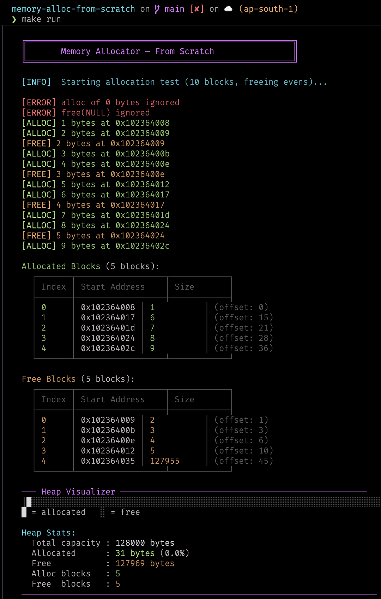
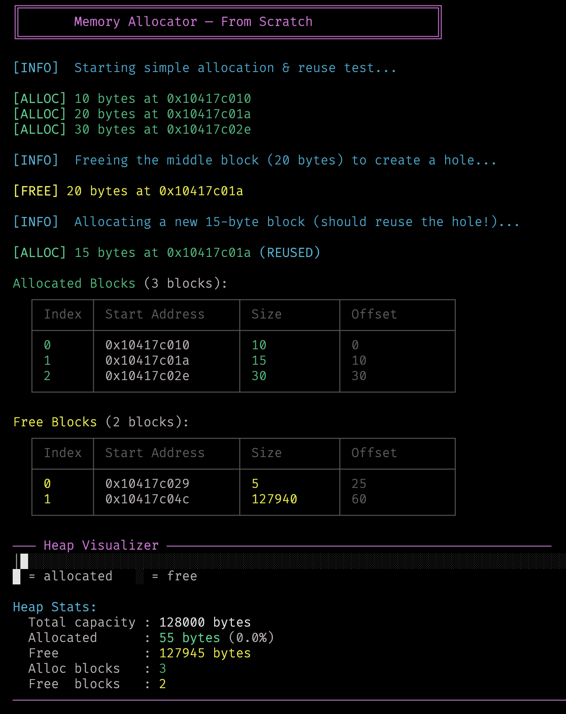
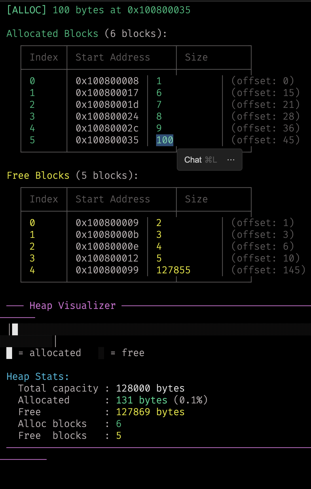
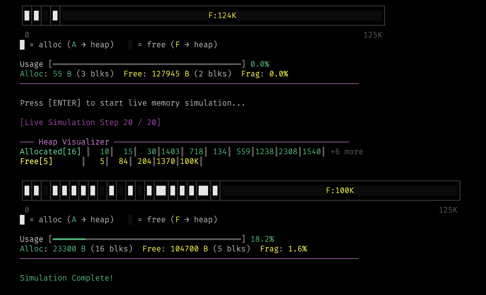

# 🧠 Memory Allocator - From Scratch

#### NOTE: Documentation generated via Antigravity 

A minimal, educational **first-fit free-list memory allocator** written in C17. This project implements dynamic memory management using a static buffer and manual bookkeeping, without relying on `malloc` or `sbrk`.

---

## Table of Contents

- [Features](#features)
- [Output & Demonstrations](#output--demonstrations)
  - [Basic Allocation & Freeing](#basic-allocation--freeing)
  - [Memory Reuse](#memory-reuse)
  - [Larger Allocation](#larger-allocation)
  - [Live Simulation Mode](#live-simulation-mode)
- [Theory](#theory)
  - [What Is a Heap?](#what-is-a-heap)
  - [Free List](#free-list)
  - [First-Fit Allocation](#first-fit-allocation)
  - [Block Splitting](#block-splitting)
  - [Coalescing](#coalescing)
  - [Fragmentation](#fragmentation)
- [Implementation](#implementation)
- [Project Structure](#project-structure)
- [Build & Run](#build--run)
- [Roadmap](#roadmap)

---

## Features

- **First-fit Allocation**: Scans the free list to find the first suitable memory chunk.
- **Block Splitting**: Exact-size carving prevents internal memory waste.
- **Coalescing**: Adjacent free blocks merge automatically to combat fragmentation.
- **Advanced Visualizer**: ASCII-art based visualization of heap fragmentation, usage, and pointer arrays.
- **Live Simulation Mode**: Animated tracking of memory allocations and frees in real-time.
- **Reuse Detection**: Tracks high-water marks to confirm holes are being filled.

---

## Output & Demonstrations

### Basic Allocation & Freeing

The allocator runs a test that allocates 10 blocks, frees the even-indexed ones, and displays the resulting heap state with a visual memory map.



### Memory Reuse

When previously freed blocks are reallocated, the allocator detects this and marks the log with **(REUSED)** — confirming that holes in the heap are being reclaimed rather than wasting memory at the tail.



### Larger Allocation

A 100-byte allocation is placed into the heap's free tail region. The heap visualizer clearly shows the allocated portion growing relative to the total capacity.



### Live Simulation Mode

The allocator features an **In-Place Live Simulation** mode that visually demonstrates pointer movements, memory usage, and fragmentation dynamically. Watch as `A` (allocated) and `F` (free) pointers dynamically update the underlying fragmented heap map!



---

## Theory

### What Is a Heap?

In most programs, `malloc` and `free` manage a region of memory called the **heap**. The OS gives the process a contiguous chunk of address space, and the allocator is responsible for carving it up into smaller blocks on demand.

This project simulates a heap using a **static array**:

```c
char heap_buffer[128000];
```

The allocator manages this buffer by maintaining two sorted lists — one for **allocated blocks** and one for **free blocks**. Every byte in the buffer belongs to exactly one of these lists at any given time.

### Free List

The allocator tracks every free region as a `MemBlock`:

```c
typedef struct {
    void  *start;
    size_t size;
} MemBlock;
```

All free blocks are kept in a **sorted array** (sorted by `start` address). Sorting enables:
- **Binary search** (`bsearch`) for O(log n) lookups when freeing.
- **Linear scan** for first-fit allocation.
- **Coalescing** — adjacent free blocks are always neighbors in the array.

### First-Fit Allocation

When `heap_alloc(size)` is called, the allocator scans the free list **from the beginning** and picks the **first block that is large enough**. First-fit is the simplest and often performs surprisingly well in practice.

### Block Splitting

If the chosen free block is **larger** than requested, the allocator **splits** it. The first portion becomes allocated; the leftover tail stays in the free list. This ensures no memory is wasted beyond what's requested.

### Coalescing

When a block is freed, it is inserted back into the free list. The allocator then checks for **adjacent free blocks** and merges them. Without coalescing, the free list would accumulate tiny fragments that can never satisfy larger allocations.

The coalescing pass runs in O(n) after every `free`.

### Fragmentation

Even with coalescing, **external fragmentation** can still occur when allocated blocks separate free regions that cannot be merged. **Internal fragmentation** is minimal in this allocator because blocks are split exactly.

---

## Implementation

- **`heap_alloc(size)`**: First-fit scan of the free list; splits the block if it's larger than requested.
- **`heap_free(ptr)`**: Finds the block via `bsearch`, moves it to the free list, then coalesces adjacent free blocks.
- **`heap_coalesce_free_blocks()`**: Merges touching free blocks to combat fragmentation.
- **`heap_visualize()`**: Renders an advanced ASCII visualization of the heap showing block arrays, directional arrows, and physical layout.
- Block lists stay sorted by address (insertion sort on add, `bsearch` on find).

---

## Project Structure

```text
├── src/
│   ├── main.c        # Allocator logic (alloc, free, coalesce) + simulation driver
│   ├── heap.h        # Types, constants, extern declarations
│   ├── display.h     # ANSI color macros, logging macros, display API
│   └── display.c     # Advanced heap visualizer and banner formatting
├── assets/
│   ├── demo.png
│   ├── reused.png
│   └── bigger_allocation.png
├── Makefile
├── TODOS.txt
└── README.md
```

---

## Build & Run

```bash
make run      # build + run
make          # build only
make debug    # launch with lldb
make clean    # remove binary
```

Requires a C17 compiler (`clang` by default).

---

## Roadmap

- [x] First-fit free-list allocator
- [x] Block splitting on allocation
- [x] Block coalescing on free
- [x] Sorted block lists (insertion sort + `bsearch`)
- [x] Advanced ASCII heap visualizer
- [x] Reuse detection logging
- [x] Live Simulation Mode
- [ ] Best-fit / worst-fit strategies
- [ ] Thread safety (mutex locking)
- [ ] Garbage collector (`gc_collect` is stubbed)
- [ ] Benchmarks vs system `malloc`